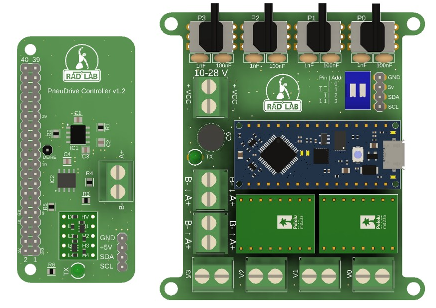
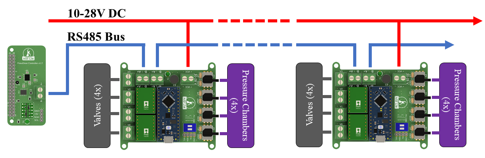

## Overview

This repository contains all of the designs, code, and instructions needed to create a low level pressure controller designed for pneumatically actuated robots. This pressure controller is designed to use relatively inexpensive off-the-shelf components and to favor simplicity in an effort to make it easy to understand and adapt for different applications.

<!-- add picture of boards from resources folder -->


The pressure control system consists of one single-board-computer (SBC) acting as the ROS master and communicating serially with one or more Arduinos. The SBC needs to be capable of running ROS/Ubuntu (e.g. Raspberry Pi, NVIDIA Jetson, Odroid). We use the [ODROID N2+](https://www.hardkernel.com/shop/odroid-n2-with-4gbyte-ram-2/). We also provide python bindings that allow you to interact with the pressure controller without ROS.

Each Arduino performs high-rate (~1 kHz) pressure control of up to 4 chambers and transmits pressure data back to the ROS master. A high level diagram of the pressure control system can be seen in the figure below:



## Dependencies

## Installation
If the SBC is connected to the internet, the easiest way to use PneuDrive is to clone the repository directly onto the SBC. If the SBC is not connected to the internet, you can clone the repository onto another computer and then copy it over to the SBC using a tool like scp over a local network:

``` console
scp -r <path to pneudrive on computer> <username@SBC_IP_ADDRESS>:<path to desired location on SBC>
```

If you intend to use PneuDrive with ROS, just make sure the package is placed into the src directory of a ROS workspace. Once the pneudrive package in in the src directory, you can build it using ```catkin_make``` from the root of the workspace.

If you intend to use PneuDrive without ROS (i.e. using the python bindings), you can place the package anywhere on the SBC. Python bindings are implemented using pybind11, so when cloning the repository, it is important to pass ```--recurse-submodules``` to git to ensure that pybind11 is cloned as well:

``` console
git clone --recurse-submodules <git url>
```

To build the bindings, you will just need to navigate to the python_bindings directory and build the bindings manually with cmake:

``` console
cd python_bindings
mkdir build
cd build
cmake ..
make
```


## How is it organized

This repository is structured as a ROS package. It is designed to be placed in a ROS workspace on the SBC used for pressure control. There are however several other directories not necessary for a ROS package:

* **pcb_design** - this directory contains all of the wiring diagrams and PCB schematics. Instructions for the population of the PCB as well as wiring the entire pressure controller are found here.
* **odroid_setup** - this directory contains all of instructions and files necessary to set up an ODROID for use as the ROS master in a pressure control system.
* **arduino_firmware** - this directory contains the instructions and code needed to program the arduinos to act as high rate pressure controllers.
* **python_bindings** - this directory contains python bindings to interact with PneuDrive independent of ROS, in a python scripting environment.


## Steps to create a pressure control system

1. Use the instructions and schematics in the **pcb_design** directory to order and assemble the necessary components to construct a PneuDrive controller PCB and several embedded PCBs.
2. Use the instructions and files in the **odroid_setup** directory to setup the SBC as the ROS master
3. Use the instructions and files in the **arduino_firmware** directory to program each arduino as a high-rate pressure controller

## Running the PneuDrive ROS Node

Once the SBC boots up it you can ssh into it with ```ssh ubuntu@192.168.0.xxx```. The username is ```ubuntu``` and the password is ```temppwd```. This process might be slightly different depending on your SBC.

Once you are logged in, you can launch the pressure control ROS node (along with a roscore) using the following command:

``` roslaunch pneudrive rs485_pressure.launch numjoints:=[number of joints]```

where the ```numjoints``` command line argument is required and tells the node how many joints to look for on the serial bus. 

This creates a ROS node called "PressureController". This launch file looks in the /config directory for a .yaml file describing the hardware configuration corresponding to how many joints you specified with ```numjoints```. The node creates publishers and subscribers for every joint specified in the yaml file. If the SBC cannot find all of the specified addresses, the node throw an error and shut down. If this happens, here are some common fixes:

* Make sure your wires are all connected securely and correctly.
* Make sure that each pressure control board dip switch is set to the proper address. The dip switch positions are printed on the pcb and they should match what is specified in the yaml file. For example, if I have a 3 joint arm, I would make sure that the first joint is set to 0 then the next as 1 and the last as 2, with those same addresses specified in the yaml file. 
* Make sure you didn't flip the A+ and B- wires when wiring up the connectors. We chose to use screw terminals for ease of use, but this does make flipping wires easier if you aren't being careful. 

When the node launches, it will print out all of the joints it detected and start the node.


