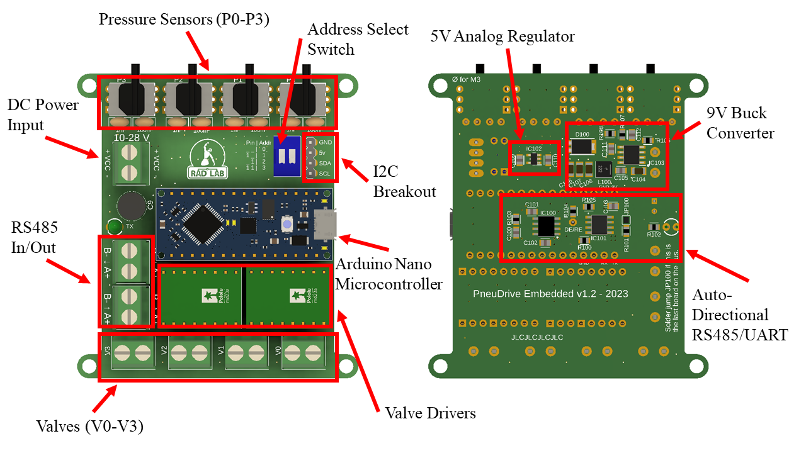

This directory contains everything you need to order and assemble the PCBs needed for PneuDrive. 

# PnueDrive Controller Board
### Ordering PCB
1) Any PCB manufacturer can be used, but we have used JLCPCB in the past. Go to their [website](https://jlcpcb.com/), click upload gerber file, and upload pneudrive_controllerv1.2_gerbers.zip. After processing, it should say "Detected 4 layer board of 65x31mm(2.56x1.22 inches) ."
2) Every manufacturing option can remain default except for the following: **Remove Order Number: Specify a Location**
3) If you want, you can order a stencil to make soldering the SMT components easier. We have not done this since there are only 1 or 2 controller boards that need to be assembled.

### Ordering Components
1) The Bill of Materials (BoM) PneuDrive BoM - Controllerv1.2.pdf. The BoM contains links to purchase components, descriptions, and part numbers. The total price as of 2023 is $5.87 USD.
2) You will also need female headers to plug things into and the logic level shifter from pololu.

### Assembly
1) Solder the SMT components to the board before any of the through hole components. This is because the through hole components will get in the way of the hot air rework station. [Here](https://www.youtube.com/watch?v=fYInlAmPnGo&pp=ygUWc210IHNvbGRlcmluZyB0dXRvcmlhbA%3D%3D) is a good tutorial on how to do SMT soldering.

# PneuDrive Embedded Board

### Ordering PCB
1)  Go to their [website](https://jlcpcb.com/), click upload gerber file, and upload pneudrive_embeddedv1.2_gerbers.zip After processing, it should say "Detected 4 layer board of 75x69mm(2.95x2.72 inches)."
2)  Every option can remain default except for the following: **Remove Order Number: Specify a Location**
3)  Order Stencil together with PCB. This costs extra, but since the embedded boards typically are assembled in volume, it is worth it.
4)  All the stencil options can stay default except the following: **Stencil Side: Bottom**

### Ordering Components
1) The Bill of Materials (BoM) PneuDrive BoM - Embeddedv1.2.pdf. The BoM contains links to purchase components, descriptions, and part numbers. The total price as of 2023 is $156.74 USD.
2) You will also need female headers to plug things into and the a4990 motor driver breakouts from pololu.

### Assembly
1) Solder the SMT components on the bottom before any of the through hole components. This is because the through hole components will get in the way of the hot air rework station. [Here](https://www.youtube.com/watch?v=fYInlAmPnGo&pp=ygUWc210IHNvbGRlcmluZyB0dXRvcmlhbA%3D%3D) is a good tutorial on how to do SMT soldering.

# Consumables

For assembly, we used the following:
* [Solder Paste](https://www.amazon.com/Wonderway-Soldering-Electronics-CELLPHONE-Repairing/dp/B0BLSJQPR6/ref=sr_1_6?crid=6NIL0QUJVAGM&keywords=solder+paste&qid=1697561173&sprefix=solder+paste%2Caps%2C127&sr=8-6) ~$15 USD
* [Flux](https://www.amazon.com/Smooth-Flow-No-Clean-syringe-plunger/dp/B08KJRCYRH/ref=sr_1_1?crid=447AJ25QBNVN&keywords=chip+quik+nc191&qid=1697561249&sprefix=chip+quik+nc191%2Caps%2C107&sr=8-1) ~$15 USD
* [Solder Wire](https://www.amazon.com/Dia0-032in-0-11lb-Precision-Electronics-Soldering/dp/B07Q167J98/ref=sr_1_5?crid=2V5IWMRTC525D&keywords=solder+lead+free&qid=1697561457&sprefix=solder+lead+free%2Caps%2C109&sr=8-5) ~$10 USD

# Tools
You'll need
* A soldering iron
* A hot air rework station (for SMT components)
