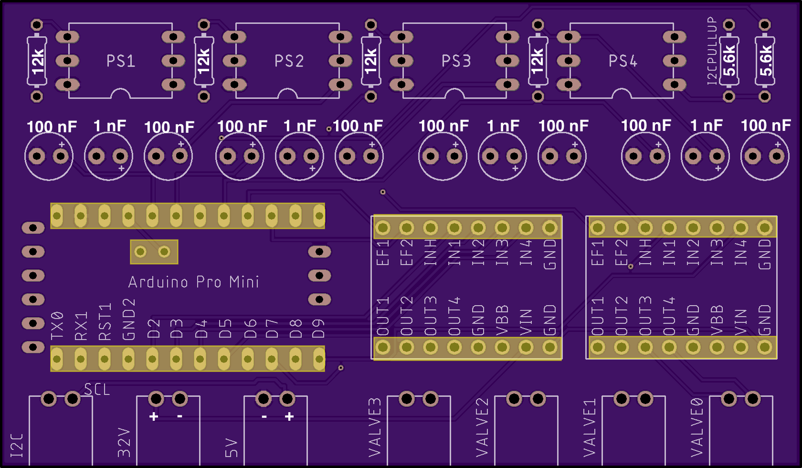

# Places to order parts

For *each* board you will need these things. For each item a link is included where we ordered them.

* 4 ABPDRNN100PGAA5 pressure sensors ([link](https://www.mouser.com/ProductDetail/Honeywell/ABPDRNN100PGAA5?qs=sGAEpiMZZMvhQj7WZhFIAD2P7qVC0dZ7tI11ZYAVyGqQk%2FMhVJdgGw%3D%3D))
* 2 Pololu A4990 Dual Motor Driver Carriers ([link](https://www.pololu.com/product/2137/))
* 1 Arduino Pro Mini ([link](https://www.amazon.com/HiLetgo-Atmega328P-AU-Development-Microcontroller-Bootloadered/dp/B00E87VWQW/ref=sr_1_5?dchild=1&keywords=arduino+pro+mini&qid=1587767052&sr=8-5))
* 7 Phoenix PTSM connectors ([link](https://www.digikey.com/en/products/detail/phoenix-contact/1778625/2625578) to female part, [link](https://www.digikey.com/en/products/detail/phoenix-contact/1778832/2625556) to male part. In previous iterations, we used [these screw terminals](https://www.amazon.com/Simpo-Terminal-Optional-300v10a-Drawing/dp/B018ORUVTU/ref=sr_1_4?dchild=1&keywords=2.54%2Bmm%2Bscrew%2Bterminal&qid=1587763307&s=industrial&sr=1-4&th=1).)
* 4 12 kOhm resistors ([link](https://www.amazon.com/EDGELEC-Resistor-Tolerance-Resistance-Optional/dp/B07HDGQRSR/ref=sr_1_2?dchild=1&keywords=12k+resistor&qid=1587767472&sr=8-2))
* 2 5.6 kOhm resistors ([link](https://www.amazon.com/EDGELEC-Resistor-Tolerance-Multiple-Resistance/dp/B07QKC1RL5/ref=sr_1_3?dchild=1&keywords=5.6k+resistor&qid=1606177582&sr=8-3))
* ~62 Female header pins (really only 58, but each cut destroys one) ([link](https://www.amazon.com/Qunqi-2-54mm-Straight-Connector-Arduino/dp/B07CGGSDWF/ref=sr_1_3?dchild=1&keywords=female+header+pins&qid=1587769954&sr=8-3))
* 8 100 nF capacitors ([link](https://www.amazon.com/Gikfun-Ceramic-Capacitor-Arduino-100pcs/dp/B00RT02YIU/ref=sr_1_9?dchild=1&keywords=100nf+capacitor&qid=1587767206&sr=8-9))
* 4 1 nF capacitors (We got away without this capacitor in the prototype...I may try that again...)

You will also need wires for:

* I2C communication. We used 8128T1 from [here](https://www.mcmaster.com/shielded-wire) because it is small gauge (24 AWG) and double shielded.
* 5V power and ground. **Note** I don't know what we're going to use yet
* 12 V power and ground. **Note** I don't know what we're going to use yet

Apart from the 5V power supply which came with your BBB, you will need a power supply capable of 9-32 V DC and however many amps your system can pull (4 A for each board). We choose to use a 12 V 15 A one ([link](https://www.amazon.com/AVAWO-Switching-Transformer-Regulated-Computer/dp/B0146IAXYO/ref=sr_1_3?dchild=1&keywords=24+volt+power+supply&qid=1587765261&sr=8-3))

# Populating the board

To populate the board, solder female headers into the board for the Arduino and both motor drivers (see yellow highlighted sections on the image below). Solder resistors, capacitors, and connectors directly into the board where shown (see image below for values).

# Things to consider for a future revision of the board

* Find a robust way to plug the pressure sensors into the board. Right now they're soldered directly to the board, but it would be convenient to be able to unplug and replace them.
* The Arduino Pro mini can take 12 V power and regulate it down to 5V on the VCC pin. This would eliminate the need to run separate 5V and 12V wires.
* Update the silkscreen for more complete labeling