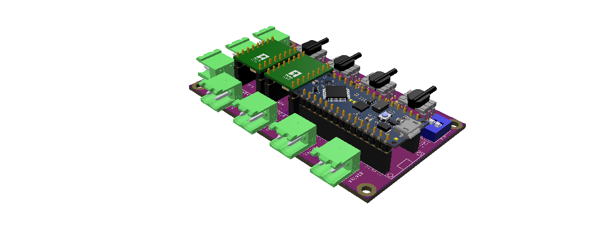
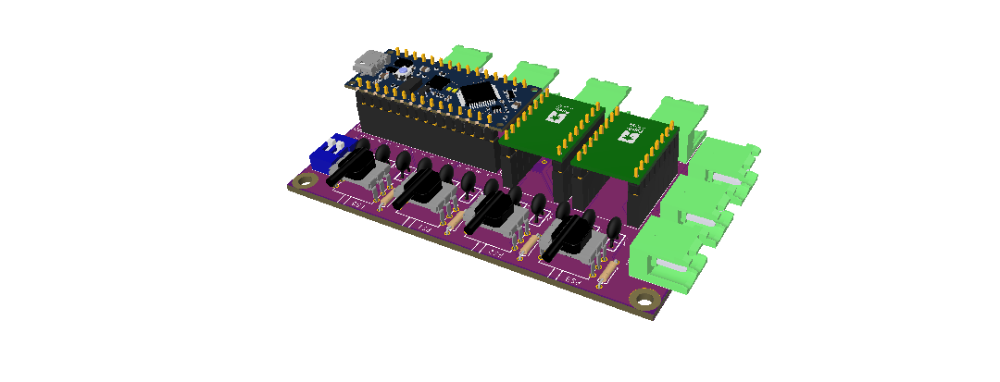
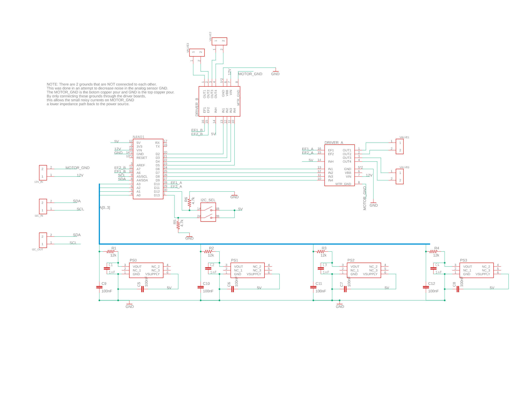

# Overview

This project was made by members of the Robotics and Dynamics Lab at Brigham Young University. This directory contains all of the necessary instructions and files for the custom PCB we designed to implement pressure control for 4 different pressure chambers. This board, in combination with our beaglebone black cape, enables the use of ROS to send and receive pressure data/commands to the lower level controller located on the arduino.

These PCBs were designed using Autodesk EAGLE. The corresponding project, board, and schematic files are found in this directory, as well as the CAM outputs.

We used OSHPARK to print out PCBs. For convenience, their design rules are also included in this repo. To use them, navigate to 'Design Rules' in Eagle and click load to select the .dru file. This will load OSHPARK's manufacturing rules automatically for design rule checking.

We have also created a custom part library which includes footprints, schematics, and 3d models for each major component used in this design. To use the library, simply add the filepath of the .lbr file to Eagle's search path in the Control Panel. For more info see [here](https://www.instructables.com/Adding-a-Library-to-Eagle-CAD/).

There are two pcbs in this directory: a beaglebone black cape and the pressure control board.

Here are some renderings of the pressure control pcb:

---
# Pressure Control Board

## Bill of Materials for each Board

| Qty |  Cost  | Value                           | Device                          | Package                         | Parts                                                   | Description                                 | PURCHASE_URL |
|-----|--------|---------------------------------|---------------------------------|---------------------------------|---------------------------------------------------------|---------------------------------------------|--------------|
| 8   | $2.00  | 100nF                           | CERAMIC_CAPACITOR               | CERAMIC_CAPACITOR               | C5, C6, C7, C8, C9, C10, C11, C12                       | Ceramic capacitors for filtering            | [link](https://www.digikey.com/en/products/detail/kemet/C315C102K1R5TA7301/6562324)         |
| 4   | $1.04  | 12k                             | R-US_0204/7                     | 0204/7                          | R1, R2, R3, R4                                          | RESISTOR, American symbol                   | [link](https://www.digikey.com/en/products/detail/vishay-beyschlag-draloric-bc-components/MBB02070C1202FCT00/7351022)          |
| 4   |  $.96  | 1nF (0.1uF)                     | CERAMIC_CAPACITOR               | CERAMIC_CAPACITOR               | C1, C2, C3, C4                                          | Ceramic capacitors                          | [link](https://www.digikey.com/en/products/detail/kemet/C322C104K5R5TA7301/3726048)             |
| 1   |  $.46  | 2PIN_DIP_DS01-254-S-02BE        | 2PIN_DIP_SWITCH                 | 2PIN_DIP_DS01-254-S-02BE        | I2C_SEL                                                 | Dip switch for selecting i2c address        | [link](https://www.digikey.com/en/products/detail/cui-devices/DS01-254-S-02BE/11310829)             |
| 2   |  $.28  | 4.7k                            | R-US_0204/7                     | 0204/7                          | R5, R6                                                  | RESISTOR, American symbol                   | [link](https://www.digikey.com/en/products/detail/vishay-beyschlag-draloric-bc-components/SFR2500004701FR500/333920)           |
| 2   | $11.90 | A4990_DUAL_MOTOR_DRIVER_CARRIER | A4990_DUAL_MOTOR_DRIVER_CARRIER | A4990_DUAL_MOTOR_DRIVER_CARRIER | DRIVER_A, DRIVER_B                                      | A4990 Dual Motor Driver Carrier (Pololu)    | [link](https://www.pololu.com/product/2137/)              |
| 1   | $10.90 | ARDUINO_NANO_EVERY              | ARDUINO_NANO_EVERY              | ARDUINO_NANO_EVERY              | NANO1                                                   | Arduino Nano Every                          | [single](https://store.arduino.cc/usa/nano-every) or [pack](https://store.arduino.cc/usa/nano-every-pack)             |
| 7   | $8.70  | PHOENIX_CONTACT_1759017         | PHOENIX_CONTACT_1759017         | PHOENIX_CONTACT_1759017         | 12V_IN, I2C_IN, I2C_OUT, VALVE0, VALVE1, VALVE2, VALVE3 | Crimpless connections for peripherals       | [female](https://www.digikey.com/en/products/detail/phoenix-contact/1759017/260463), [male](https://www.digikey.com/en/products/detail/phoenix-contact/1757019/260379), or [set](https://www.amazon.com/Willwin-Pitch-Pluggable-Terminal-Connectors/dp/B077GTYZVM/ref=sr_1_15?dchild=1&keywords=PCB%2BMount%2BScrew%2BTerminal%2BBlock%2C%2Bright%2Banlge%2BPlug-in%2B2-Pin%2B(2%2BPole)%2BScrew%2BTerminal%2BBlock%2BConnector%2C%2BPluggable%2BMale%2BFemale%2BPhoenix%2BType%2BConnector&qid=1619925723&s=hi&sr=1-15&th=1)             |
| 4   | $76.84 | PRESSURE_SENSOR_ABPDRNN100PGAA5 | PRESSURE_SENSOR_ABPDRNN100PGAA5 | PRESSURE_SENSOR_ABPDRNN100PGAA5 | PS0, PS1, PS2, PS3                                      | Honeywell Pressure Sensor (ABPDRNN100PGAA5) | [link](https://www.mouser.com/ProductDetail/Honeywell/ABPDRNN100PGAA5?qs=sGAEpiMZZMvhQj7WZhFIAD2P7qVC0dZ7tI11ZYAVyGqQk%2FMhVJdgGw%3D%3D)             |

NOTE: We want our pcb to be easy to service if things break. So instead of soldering parts directly to the pcb, we use [female headers](https://www.amazon.com/Qunqi-2-54mm-Straight-Connector-Arduino/dp/B07CGGSDWF/ref=sr_1_3?dchild=1&keywords=female+header+pins&qid=1587769954&sr=8-3) to plug the arduino and motor drivers in so that they can be replaced easily.

The total price per board (including printing the pcb) is about $150 (parts are $113.08 and Oshpark charges about $40 for 3 copies of the pcb). Note that there are farily significant bulk discounts for many of these parts. 

## Schematic

## Specifications and Design Notes
### I2C Design
The I2C bus on this pcb has both an IN and OUT port. The OUT port is useful for daisy chaining multiple of these pcbs, but is not required. The arduino communicates on a 5V logic level, which is incompatible with the 3.3V logic of the BBB. To remedy this, we use a bi-directional logic level shifter to make sure voltages are at the right levels for each device. The shifter is used once on the BBB cape and outputs 5V to any arudino board down the line. The logic shifter uses 10k pullup resistors on the SDA and SCL lines. According to [this](https://www.ti.com/lit/an/slva689/slva689.pdf?ts=1612978067135&ref_url=https%253A%252F%252Fwww.google.com%252F) resource, 10k is too high for our I2C line. 

The max for I2C fast mode is 400 pF according to Table 1. Since we don't have that many devices and the wires aren't super long, we assumed a bus capacitance of about 150pF. This combined with the operating voltage of 5V on fast mode gives a minimum resistance value of about 1.5k (from Fig 2) and a max resistance of about 2.5k 9 (from Fig 3). In order to get an equivalent resistance in this range with the 10k resistors in the logic shifter, we add a 2.2k resistor in parallel to get an equivalent pullup resistance of 1.8k. We measured the performance of the I2C bus with these resistors in place and observed about 380-390Hz bit rate (the 10k resistors alone work, but the bit rate was ~340Hz and the voltage level was barely reaching high). The closer the equivalent resistance is to the minimum resistance, the faster the line can transfer data at the cost of higher power consumption. 

### PCB Design Notes

* Trace widths on the board are mostly the default that eagle uses with a few exceptions. The 12V line is 80mils wide and the 5V line is 30 mils wide. The trace for the 12V line was made as as large as possible because it is a high current line. Each 2 phase driver board can deliver 0.7 amps/phase, which gives a total continuous current of up to 2.8A on each board. The driver boards can go up to 0.9A/phase, but not for long. Using [this](https://www.digikey.com/en/resources/conversion-calculators/conversion-calculator-pcb-trace-width) trace width calculator tool (with 2.8A, 1oz/ft^2, and an ambient temp of 25C) gives us an acceptably low temperature rise (5-10C) for an external trace.

* There are two ground planes in this PCB. The top plane is for the signal ground and the bottom plane is the motor power ground. This was done in an attempt to minimize noise from the motors on the analog pressure sensors. These ground are connected through the GND pins on the driver boards so that the both ground planes are connected to each other when it is running. But by only connecting the ground planes through the driver boards, it encourages any noisy currents to follow the path of least impedance (the ground plane) back to source instead of going through the signal ground. We used [this](https://www.nxp.com/docs/en/application-note/AN1259.pdf) and [this](https://electronics.stackexchange.com/questions/112508/ground-vs-power-ground) as resources as to why we chose to do this. We also did our best to separate the two areas of the board (i.e. the drivers from the pressure sensors) as much as possible without making the board too big. 

* The mounting holes are designed for M3 screws.

## Board and CAD File

See [here](https://a360.co/2NUtMc7) to see the 3d version of the board. You can download a step file too if you want to design a case, for example.

## Things to consider for a future revision of the board

* Find a robust way to plug the pressure sensors into the board. Right now they're soldered directly to the board, but it would be convenient to be able to unplug and replace them.
* Do something with the EF pins on the driver boards. Right now they are connected to the arduino, but not doing anything with them. 
* We are using shielded cable for the i2c bus. Technically, the cable shield should be grounded somewhere. It isn't currently. Could add a screw terminal to the board to ground the bare ground wire possibly.

---
# Beaglebone Black Cape

## Bill of Materials

| Qty | Cost  | Value                      | Device                     | Package                 | Parts                                        | Description                                   | Purchase Link                                                                                                                                                                                                                                                                                                                                                                                                                                             |
|-----|-------|----------------------------|----------------------------|-------------------------|----------------------------------------------|-----------------------------------------------|-----------------------------------------------------------------------------------------------------------------------------------------------------------------------------------------------------------------------------------------------------------------------------------------------------------------------------------------------------------------------------------------------------------------------------------------------------------|
| 4   |       | 2.2k                       | R-US_0204/7                | 0204/7                  | R1, R2, R3, R4                               | RESISTOR, American symbol                     |                                                                                                                                                                                                                                                                                                                                                                                                                                                           |
| 5   | $8.70 | PHOENIX_CONTACT_1758018    | PHOENIX_CONTACT_1758018    | PHOENIX_CONTACT_1758018 | GND, I2C1_OUT, I2C2_OUT, PWR_BUT, PWR_ENABLE | Crimpless peripheral connections              | [female](https://www.digikey.com/en/products/detail/phoenix-contact/1758018/260496), [male](https://www.digikey.com/en/products/detail/phoenix-contact/1757019/260379), or [set](https://www.amazon.com/Willwin-2-Pin-5-08mm-Female-Terminal/dp/B077979RZR/ref=pd_di_sccai_3?pd_rd_w=A5pho&pf_rd_p=c9443270-b914-4430-a90b-72e3e7e784e0&pf_rd_r=5PEX8D4W251F0MR04JT6&pd_rd_r=e4559510-59fe-4a1b-9aaf-c49878303df9&pd_rd_wg=2cx5U&pd_rd_i=B077979RZR&th=1) |
| 1   | $2.50 | POLOLU_LOGIC_SHIFTERPOLOLU | POLOLU_LOGIC_SHIFTERPOLOLU | POLOLU_LOGIC_SHIFTER    | SHIFTER1                                     | Logic Level Shifter, 4-Channel, Bidirectional | [link](https://www.pololu.com/product/2595)                                                                                                                                                                                                                                                                                                                                                                                                               |

NOTE: BBB protocape ([link](https://www.adafruit.com/product/572)) was useful in prototyping. This has been replaced by our own custom pcb. 

Total cost of this board is about $50. (parts are about $10 and Oshpark charges about $40 for 3 copies of the pcb).

## Schematic

## Design Notes
 * See I2c Design above.
 * We chose to use vertical Phoenix connectors for this board because it is to be mounted inside of an enclosure and the right angle connectors take up a lot of space. 
 * The power button connection is connected to the beaglebone's power button for a hardware method to power down the beaglebone (see this [example](http://gencarelle.com/blog/2014/08/26/power-button-for-beaglebone-black/)).
 * There are two i2c buses on the BBB (technically 3, but one is used internally). There is one connector for access to each bus.
 * The power enable connection is for the estop and power relay. This is a digital ouput so that both the estop and the beaglebone can both control power while still keeping the estop software independent for safety. See the FOLLOWING DIAGRAM:
 * Ground connection is just an extra access point to BBB ground so that the power supply can be grounded together with the beaglebone.
 
# Putting it all together

## Enclosure Stuff:

* [Enclosure](https://www.amazon.com/12-2-115mm-Metal-Enclosure-Project/dp/B07G95V7YC/ref=pd_di_sccai_1?pd_rd_w=I5rdI&pf_rd_p=c9443270-b914-4430-a90b-72e3e7e784e0&pf_rd_r=7QFJZRAB7NJ2AP8N4YB6&pd_rd_r=0771ee2a-d3c7-4df1-b478-44d31392f34c&pd_rd_wg=qigFo&pd_rd_i=B07G95V7YC&th=1) on amazon fits everything nicely. 
* [Panel mount ethernet extension](https://www.adafruit.com/product/4215?gclid=Cj0KCQjw-LOEBhDCARIsABrC0TlaVVkPRgYQnkOMLTnrQEoghTae29z3SAouX9LPYDEf6-AYeaxEKM8aAt0_EALw_wcB)
* [Panel mount usb extension](https://www.adafruit.com/product/4055?gclid=Cj0KCQjw-LOEBhDCARIsABrC0Tl8-U2JYnmXrtTfUWt_J1TNg8gNP91sTYFdloDnbkfO0Z6vgGVJUYgaArRYEALw_wcB)
* [Panel mount Phoenix contact connectors](https://www.digikey.com/en/products/detail/phoenix-contact/0707248/348291?utm_adgroup=Terminal%20Blocks%20-%20Panel%20Mount&utm_source=google&utm_medium=cpc&utm_campaign=Shopping_Product_Connectors%2C%20Interconnects&utm_term=&utm_content=Terminal%20Blocks%20-%20Panel%20Mount&gclid=Cj0KCQjw-LOEBhDCARIsABrC0Tki_DSLXojhLEQjRhTL7HOXp9duJyBKhw32B4YBV-cMwi0aZF9Q28caAgXcEALw_wcB). These are used for the Estop in, i2c out, and power out connections.
* [Panel mount power button](https://www.adafruit.com/product/1505)

## Additional random stuff:

* I2C communication wires. We used this[here](https://www.mcmaster.com/8128T1/) because it is double shielded and rated for up to 35 Mbps data rates (we are at 400kbps).
* 12v DC power supply. Rated for at least 12A continuous. (each board can pull max 2.8 amps continuously, up to 3.6 amps briefly) ([link](https://www.amazon.com/AVAWO-Switching-Transformer-Regulated-Computer/dp/B0146IAXYO/ref=sr_1_3?dchild=1&keywords=24+volt+power+supply&qid=1587765261&sr=8-3))
* 12 V power and ground wire. (16 AWG rated for 12 amps). INSERT LINK HERE.
* Splicing connections are useful for getting 12V to each arudino board in a quick and clean way ([link](https://www.amazon.com/dp/B07XMJ5KTY/ref=sspa_dk_detail_0?spLa=ZW5jcnlwdGVkUXVhbGlmaWVyPUFPUFdLM1RZU1g4M0kmZW5jcnlwdGVkSWQ9QTAzODQzNDEyU1RMUVlGNVgwM1VNJmVuY3J5cHRlZEFkSWQ9QTAwNTA5MTUyWERMTFQ3TzBUUDNIJndpZGdldE5hbWU9c3BfZGV0YWlsMiZhY3Rpb249Y2xpY2tSZWRpcmVjdCZkb05vdExvZ0NsaWNrPXRydWU&th=1))
* Digitally controlled power strip for controlling power to arduinos from BBB on e-stop. ([link](https://www.sparkfun.com/products/14236))
* Plastic tubing that fits pressure sensors (2mm ID, rated for at least 85 psi). We use [this](https://www.mcmaster.com/8014N13/).
* Barbed fittings that fit tubing (2mm, rated for up to 100 psi). We use [this](https://www.mcmaster.com/6220N78/).
